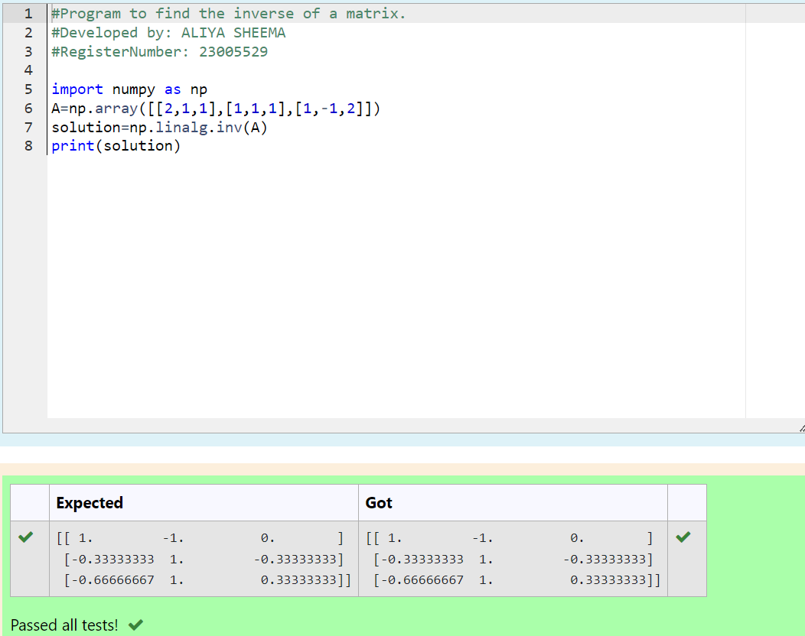

# INVERSE-OF-A-MATRIX
NAME : ALIYA SHEEMA 

REFERENCE NUMBER : 23005529

DEPARTMENT : AIDS
## AIM :
To write a python program to find the inverse of a matrix
## EQUIPEMENT'S REQUIRED :
1. 	Hardware – PCs
2. 	Anaconda – Python 3.7 Installation / Moodle-Code Runner
## ALGORITHM :
### Step 1 : 
Import the numpy module to use the built-in function for calculation.

### Step 2 : 
Prepare the lists from linear equation and assign in np.array().
### Step 3 : 
Using the np.linalg.inv(), we can find the rank of the given matrix.
### Step 4 : 
End the Program.  

## PROGRAM :
```
#Program to find the inverse of a matrix.
#Developed by: ALIYA SHEEMA
#RegisterNumber: 23005529

import numpy as np
A=np.array([[2,1,1],[1,1,1],[1,-1,2]])
solution=np.linalg.inv(A)
print(solution)
```
## OUTPUT :

Python program to find the inverse of a matrix.



## RESULT :

Thus the inverse of given matrix is successfully solved using python program

